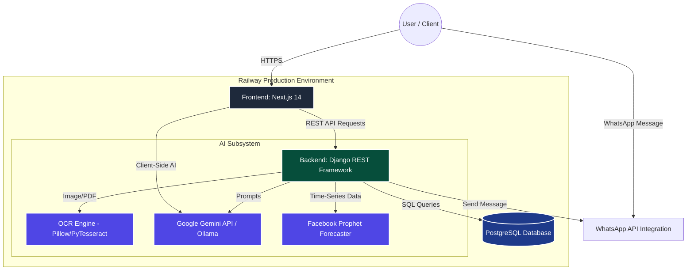
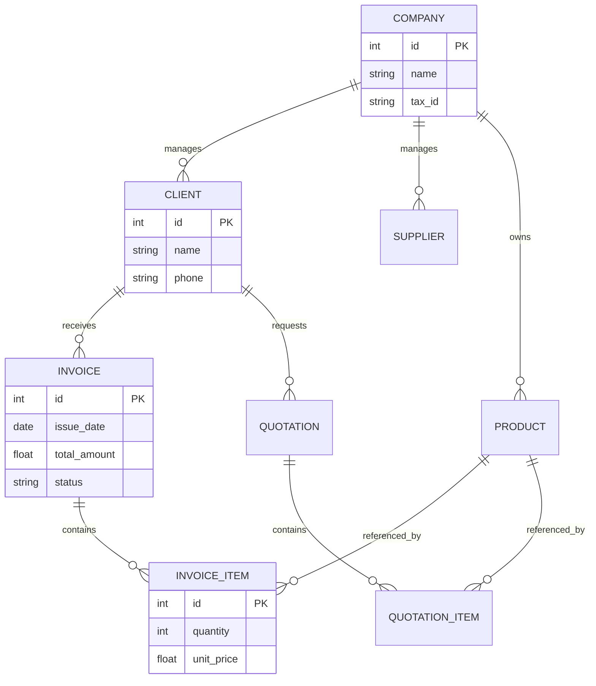
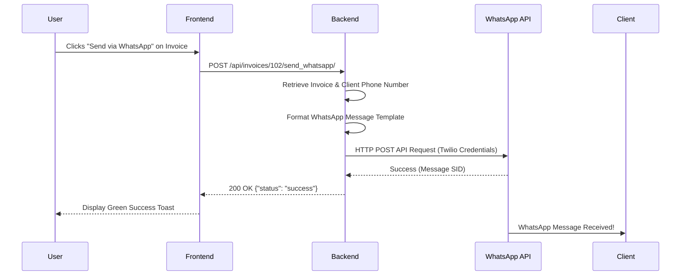
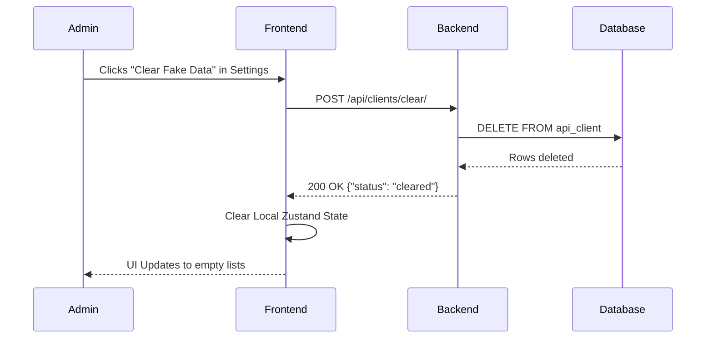

# Software Architecture & Detailed Design Document (SAD & SDD)

**Project:** Fawatir (Intelligent ERP, CRM, & Invoicing System)  
**Version:** 2.0.0  
**Date:** August 2026  

---

## 1. Executive Summary

Fawatir is a highly advanced, enterprise-grade Resource Planning (ERP) platform designed specifically for modern Moroccan businesses. It combines core business management modules—including Accounting, Inventory, Human Resources, Point of Sale, and CRM—with cutting-edge Artificial Intelligence capabilities. Features such as Automated OCR Document Parsing, AI-Driven Chatbots, and WhatsApp Integration automate data entry and provide businesses with strategic, actionable insights.

---

## 2. Software Architecture Design (SAD)

### 2.1 Architectural Patterns

The system operates on a **Decoupled Client-Server Architecture** utilizing RESTful API communication, ensuring scalability and maintainability.

- **Frontend Subsystem:** A Server-Side Rendered (SSR) Component-Based Architecture powered by **Next.js 14** (React). It utilizes the Next.js App Router paradigm.
- **Backend Subsystem:** Follows the Model-Template-View (MTV) architectural pattern inherent to **Django**, exposing a secure REST API via the **Django REST Framework (DRF)**.
- **AI/ML Layer:** Operates as a specialized subsystem within the backend to handle asynchronous, computationally heavy tasks (OCR processing, LLM prompting).
- **Database Layer:** A relational database management system using **SQLite** (development) / **PostgreSQL** (production) managed via the Django ORM.

### 2.2 High-Level Architecture Diagram

### 2.3 Containerization & Deployment Architecture

The system is deployed on **Railway**, utilizing a Monorepo deployment strategy optimized for cloud execution:
- **Frontend Build (Nixpacks):** The Next.js application is located at the root of the repository. Railway's Nixpacks automatically detects the `package.json`, installs dependencies using `npm`, and builds the standalone Next.js server. This avoids Docker Out-Of-Memory (OOM) issues and results in a highly optimized deployment.
- **Backend Build (Docker):** The backend is containerized using `fawatir_backend/Dockerfile`. It provisions a Python 3.12 Alpine environment, installs system-level dependencies for data science tools, and serves the Django application via Gunicorn.
- **CI/CD Pipeline:** GitHub Actions automatically tests the backend (`python manage.py test`) and validates the frontend build on every push.

---

## 3. Software Detailed Design (SDD)

### 3.1 Frontend Subsystem (Presentation Layer)

The frontend is engineered for extreme performance and UX excellence.

- **UI Architecture:** Built using functional React components styled with **TailwindCSS**. The UI adheres to a modern "Bento Grid" spatial design language, ensuring responsiveness across desktop and mobile.
- **State Management:** **Zustand** is used for lightweight, globally accessible state stores. This removes the boilerplate of Redux while providing powerful hooks.
- **Data Fetching:** Hybrid approach utilizing Next.js Server Components for initial data load (SEO optimization) and Client Components for dynamic interactivity (e.g., modifying invoices).
- **AI Rendering:** Integrates `react-markdown` and `remark-gfm` to elegantly render rich markdown responses generated by the AI chatbot.

### 3.2 Backend API Modules (Application Layer)

The Django backend defines distinct, robust modules managed by `rest_framework.routers.DefaultRouter`. These endpoints map directly to underlying relational models.

| Module | Core Endpoints & Responsibilities |
| :--- | :--- |
| **CRM** | `/api/clients/`, `/api/suppliers/` Manages customer relationships. Includes custom actions like `/clear/` to flush mock data. |
| **Inventory** | `/api/products/` Tracks inventory levels, categories, and SKU generation. |
| **Accounting** | `/api/invoices/`, `/api/quotations/` Core financial ledger. Supports custom actions like `/send_whatsapp/` for instant client communication and `/send_email/`. |
| **HR & Payroll** | `/api/employees/`, `/api/bulletins/` Staff management, attendance, and payslip generation. |
| **Point of Sale** | `/api/pos-sessions/` In-store transaction handling. |
| **AI Hub** | `/api/ai-conversations/` Manages asynchronous AI tasks and prompt history. |

### 3.3 Database Entity-Relationship Model (Core Modules)

### 3.4 Feature Deep-Dive: WhatsApp Integration Workflow

The system provides one-click WhatsApp invoice delivery, bypassing manual communication.

### 3.5 Feature Deep-Dive: System Data Clearing (Testing Mode)

To allow the user to easily wipe mock data and prepare the system for production, specific administrative endpoints were engineered.

---

## 4. Technology Stack & Dependencies

### 4.1 Frontend Stack
- **Core:** Next.js 14, React 18
- **Styling:** TailwindCSS, `clsx`
- **Iconography:** `lucide-react`
- **State Management:** `zustand`
- **Utilities:** `xlsx` (Excel generation), `date-fns` (Date formatting)

### 4.2 Backend Stack
- **Core:** Python 3.12, Django 6.x, Django REST Framework
- **Data Science:** `pandas`, `numpy`, `prophet` (Time-series forecasting)
- **AI & Integrations:** `google-generativeai`, `twilio`
- **Database:** SQLite3 / PostgreSQL

---

## 5. Security & System Integrity

- **Environment Injection:** Sensitive cryptographic keys (`SECRET_KEY`, `GEMINI_API_KEY`, `TWILIO_AUTH_TOKEN`) are never hardcoded. They are injected at runtime via Railway Environment Variables.
- **Data Validation:** Both incoming requests and AI-generated outputs are rigorously validated using DRF Serializers and Pydantic schemas to prevent injection attacks and ensure database integrity.
- **Cross-Origin Resource Sharing (CORS):** Strictly configured via `django-cors-headers` to ensure that only the trusted Next.js frontend origin can execute mutations on the database.
