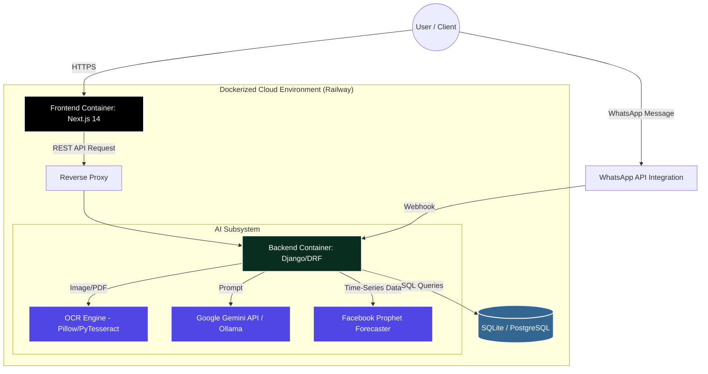

# Software Architecture & Detailed Design Document (SAD & SDD)

**Project:** Fawatir (Intelligent ERP, CRM, & Invoicing System)  
**Version:** 1.0.0  

---

## 1. Executive Summary
Fawatir is a comprehensive Enterprise Resource Planning (ERP) platform designed for modern Moroccan businesses. It combines core business management modules (Accounting, Inventory, HR, CRM) with advanced Artificial Intelligence capabilities (OCR document parsing, time-series forecasting, and generative AI) to automate data entry and provide strategic insights.

---

## 2. Software Architecture Design (SAD)

### 2.1 Architectural Patterns
The system relies on a **Decoupled Client-Server Architecture** utilizing RESTful communication.
- **Frontend:** Follows a Component-Based Architecture using React (Next.js).
- **Backend:** Follows the Model-Template-View (MTV) architectural pattern inherent to Django, exposing data via a robust REST API (Django REST Framework).
- **AI/ML Layer:** Operates as a specialized subsystem within the backend, executing computationally heavy tasks (OCR processing, LLM prompting) asynchronously.

### 2.2 High-Level Architecture Diagram

### 2.3 Containerization & Deployment
The system is fully containerized using **Docker** and deployed on **Railway**.
- `Dockerfile.frontend`: Uses a multi-stage build (`node:18-alpine`) optimized for Next.js `standalone` output, significantly reducing container size.
- `Dockerfile` (Backend): Containerizes the Python 3 environment, installing system dependencies required for data science libraries (Pandas, Numpy) before installing pip requirements.

---

## 3. Software Detailed Design (SDD)

### 3.1 Frontend Subsystem (Presentation Layer)
The frontend utilizes the Next.js **App Router** (`app/` directory paradigm) for layouts and routing.
- **UI Architecture:** Built using functional React components styled with **TailwindCSS** and `clsx` for conditional classes. The UI follows a modern "Bento Grid" spatial design language.
- **State Management:** **Zustand** is used for lightweight, globally accessible state stores without the boilerplate of Redux.
- **Data Rendering:** Uses `react-markdown` and `remark-gfm` for rendering rich AI responses in the chatbot widget.
- **Excel Export:** Integrates `xlsx` to allow clients to download reports locally.

### 3.2 Backend API Modules (Application Layer)
The Django backend defines 10 core modules managed by `rest_framework.routers.DefaultRouter`. These endpoints map directly to underlying relational database models:

| Module | Core Endpoints & Responsibilities |
| :--- | :--- |
| **Core Admin** | `/users`, `/companies`, `/permissions`, `/audit-logs` Manages multi-tenant configurations and RBAC (Role-Based Access Control). |
| **CRM** | `/clients`, `/suppliers`, `/marketing-campaigns`, `/whatsapp-messages` Handles external relationships and messaging. |
| **Inventory** | `/products`, `/product-variants`, `/stock-movements` Tracks inventory levels and warehouse movements. |
| **Accounting** | `/invoices`, `/payments`, `/bank-transactions`, `/bank-reconciliations` Core financial ledger and invoice generation. |
| **Quotations** | `/quotations`, `/quotation-items` Pre-sale proposals and estimates. |
| **Purchasing** | `/purchase-orders` Supply chain and procurement tracking. |
| **Point of Sale** | `/pos-sessions`, `/pos-sales` In-store transaction handling. |
| **HR** | `/employees`, `/payrolls` Staff management and salary generation. |
| **AI Hub** | `/ocr-documents`, `/ai-conversations`, `/ai-recommendations` Manages asynchronous AI tasks and prompt history. |
| **Support** | `/tickets` Internal helpdesk for users. |

### 3.3 AI Pipeline Detailed Workflow
One of the most complex subsystems is the Automated Invoice Extraction.

1. **Ingestion:** User uploads a scanned invoice image or PDF.
2. **Preprocessing:** The image is processed using `Pillow` to enhance contrast for OCR.
3. **Extraction:** The backend's `manual_ocr.py` script attempts initial text layout detection.
4. **Semantics:** The extracted raw text is sent to the LLM (`google-generativeai` or local `Ollama`) with a strict system prompt demanding a JSON return format defining the `client`, `total_amount`, `date`, and line `items`.
5. **Validation:** Pydantic is utilized to validate the structured JSON against the expected schema before saving it to the SQLite database via the Django ORM.

---

## 4. Technology Stack & Dependencies

### 4.1 Frontend Stack
- **Framework:** Next.js 14 (`next`, `react`, `react-dom`)
- **UI / Styling:** TailwindCSS, `lucide-react` (iconography), `clsx`
- **State & Utils:** `zustand`, `@google/genai` (direct client-side AI integration), `xlsx`

### 4.2 Backend Stack
- **Web Framework:** Django 6.x, Django REST Framework (`djangorestframework`)
- **Data Science & ML:** `pandas`, `numpy`, `prophet` (time-series forecasting for revenue), `plotly` (graph generation)
- **Image & AI:** `pillow`, `google-generativeai`
- **Validation:** `pydantic`
- **API Documentation:** `drf-spectacular` (generates automated OpenAPI schema mapped to `/api/schema/` and `/api/docs/`)

---

## 5. Security & Considerations
- **Environment Management:** Sensitive keys (`SECRET_KEY`, `GEMINI_API_KEY`) are injected via `.env.local` locally and via Railway Variables in production.
- **CORS:** Controlled via `django-cors-headers` to ensure only the Next.js frontend origin can query the backend.
- **Next.js Telemetry:** Disabled via `ENV NEXT_TELEMETRY_DISABLED 1` in the Dockerfile to comply with enterprise data privacy standards.
